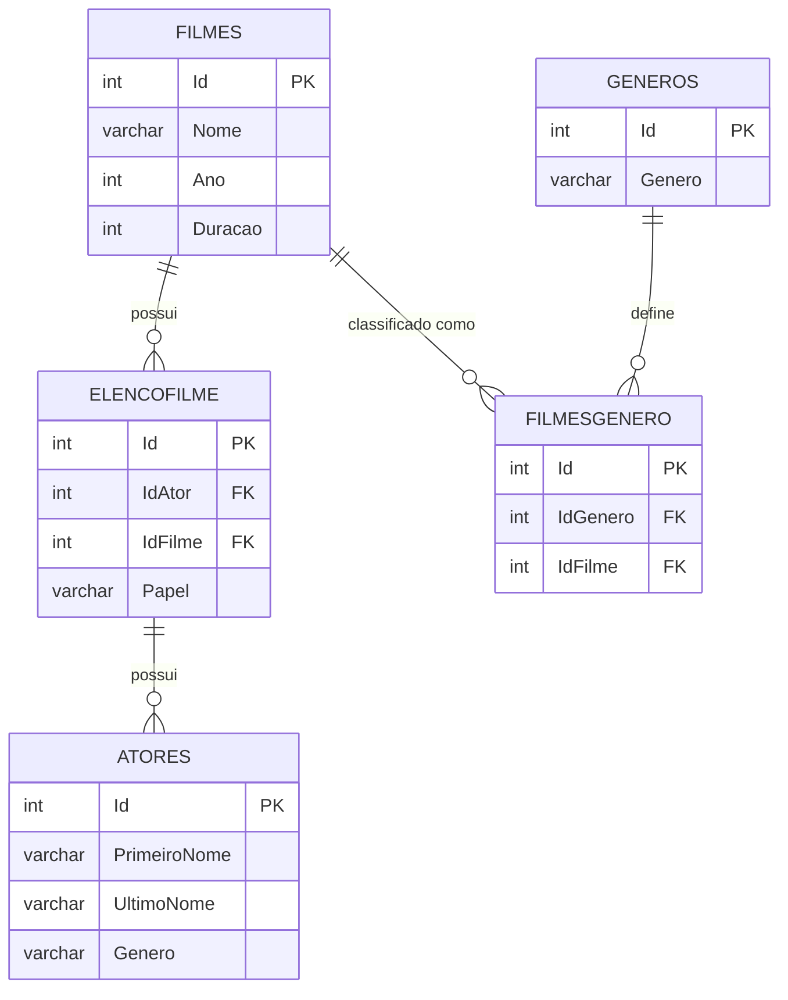

# 🎬 Banco de Dados de Filmes

Este projeto é uma solução containerizada para o desafio de banco de dados do **Bootcamp TIVIT & DIO**.

O objetivo é demonstrar competências em queries T-SQL complexas, orquestração de ambientes com Docker e deploy na Azure. O projeto sobe automaticamente um servidor SQL populado e uma interface gráfica moderna para gerenciamento.

**Implementação no Azure SQL Database:**


## 🛠️ Tecnologias Utilizadas

* **Azure SQL Edge:** Versão leve do SQL Server otimizada para containers (arquitetura ARM/AMD64).[¹]
* **CloudBeaver:** Interface web para gerenciamento e visualização do banco (substituto moderno ao Adminer/SSMS).
* **Docker Compose:** Para orquestração dos serviços.
* **T-SQL:** Scripts de criação e população automática.
[¹]: A Microsoft aposentou este serviço em setembro de 2025. Estou usando-o neste projeto para faciliar a utilização daqueles que forem testá-lo, tendo em vista que o SQL Server requereria mais configurações no Docker Desktop para quem for rodar em Windows.

## 🚀 Pré-requisitos

* [Docker](https://www.docker.com/products/docker-desktop/) instalado e rodando.

---
## 🧩 Diagrama Entidade-Relacionamento (DER)

Abaixo está a representação visual da estrutura do banco de dados, mostrando as tabelas, colunas e relacionamentos (Chaves Estrangeiras) definidos no script de inicialização.


---
## 🏃‍♂️ Como Executar (Passo a Passo)

Siga os passos abaixo para subir o ambiente completo na sua máquina.

### 1. Clone o Repositório
```bash
git clone https://github.com/gbad8/trilha-net-banco-de-dados-desafio.git
```
### 2. Suba os Containers
Entre no repositório e execute o comando abaixo na raiz do projeto. O Docker irá baixar as imagens e configurar a rede.
```bash
docker compose up
```
Nota: Na primeira execução, o script scriptsFilmes.sql rodará automaticamente para criar o banco de dados e inserir os dados iniciais. Aguarde cerca de 10 a 20 segundos para o SQL Server inicializar completamente.

## 📊 Configurando o Acesso ao Banco Containerizado
Por motivos de segurança e boas práticas, as configurações de usuário da interface gráfica não foram versionadas no Git. Siga os passos rápidos abaixo para conectar:
### 1. Acessar a Interface
Abra seu navegador e acesse:👉 http://localhost:8978.

### 2. Configuração Inicial (Primeiro Acesso)
Ao abrir, você verá uma tela de boas-vindas do CloudBeaver.
* Clique em Next.
* O sistema vai pedir para criar um Servidor. Porém, tudo já vai estar praticamente pronto. Apenas role a página para baixo e crie um usuário administrativo (ex: admin) e defina uma senha de sua preferência.
* Clique em Finish. O sistema vai pedir para você fazer login. Entre com as credenciais cadastradas na etapa anterior. 

### 3. Conectar ao Banco de Dados
Agora, vamos conectar a interface ao container do banco.
* No menu principal, clique no ícone de Banco de Dados (New Connection).
* Selecione o tipo de Banco, no nosso caso: SQL Server.
* Selecione a aba Manual (não use a URL JDBC).
* Preencha com as credenciais do projeto:

| Campo | Valor |
| :--- | :--- |
| **Host** | `desafio-db` |
| **Port** | `1433` |
| **Database** | deixe em branco |
| **Username** | `sa` |
| **Password** | `Tivit&DioDesafio123!` |

### 4. Clique em Test Connection
O sistema verificará a comunicação entre os containers. Aguarde a mensagem de sucesso (geralmente um pop-up verde indicando "Connected").

### 5. Clique em Create
A nova conexão aparecerá no menu lateral "Database Navigator", pronta para ser explorada.

---
## 🤝 Contribuição e Feedback
Projeto desenvolvido como parte da trilha de aprendizado da DIO. Sugestões são bem-vindas!
